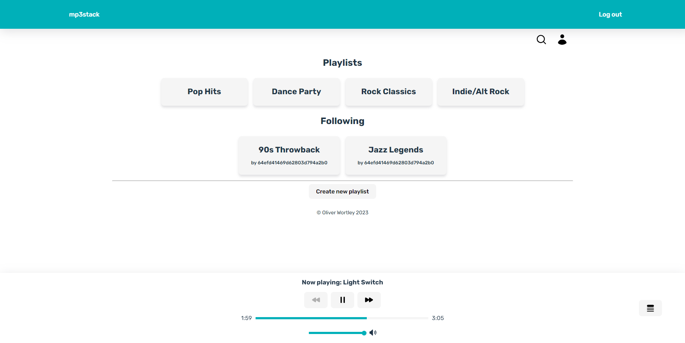

# mp3stack

Web-based MP3 player with ability to play and queue tracks, create and edit playlists, and view and follow other users' playlists. Svelte was chosen for building the web UI thanks to its high performance, reactivity, and easily configurable writable stores. The backend was devised with ExpressJS and MongoDB, with multer and mongoose being used for audio file upload handling and database interaction respectively. Memurai has also been integrated for server-side track caching, enhancing API performance and responsiveness.

